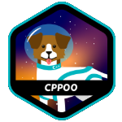
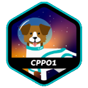
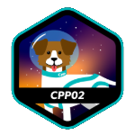
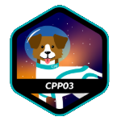
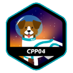
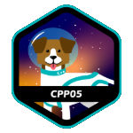
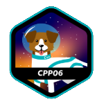
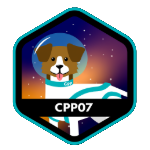
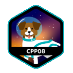

# 42 Projects

Consolidated archive of my 42 Heilbronn projects.

Each original repository lives in its own top-level directory. The merge preserved
the original Git histories where the source repositories had commits.

## C Projects

## C++ Projects

## Included Repositories

- `42HN-libft`
- `42HN-ft-printf`
- `42HN-get-next-line`
- `42HN-pipex`
- `42HN-push-swap`
- `42HN-philosophers`
- `42HN-minishell`
- `42HN-fractal`
- `42HN-miniRT`
- `42HN-IRC-server`
- `42HN-CPP-00`
- `42HN-CPP-01`
- `42HN-CPP-02`
- `42HN-CPP-03`
- `42HN-CPP-04`
- `42HN-CPP-06`

## Notes

Because miniRT, fract-ol, Minishell, and the IRC server require additional
dependencies, each project includes its own Dockerfile for a consistent,
portable setup. Build and run the containers from their respective project
directories, then feel free to explore.
